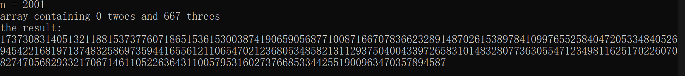
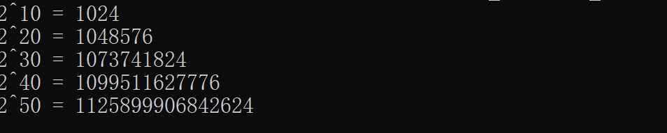
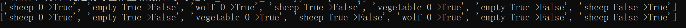
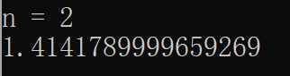
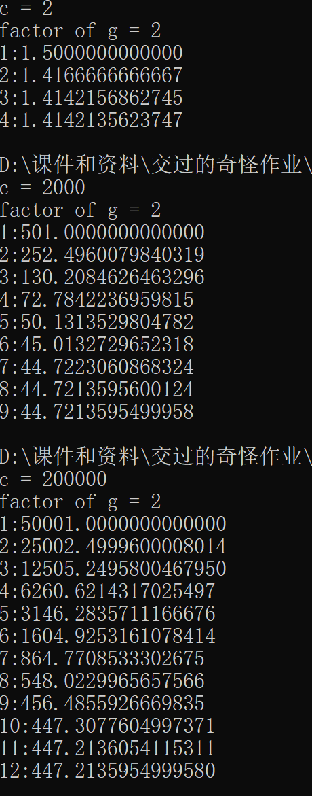
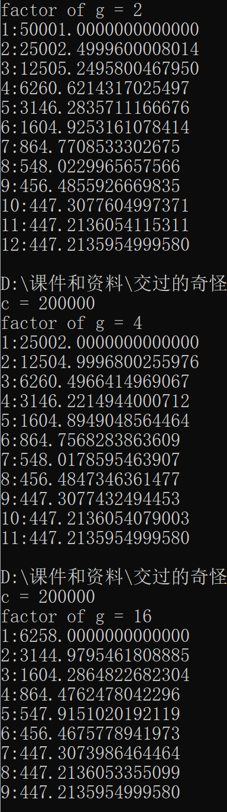
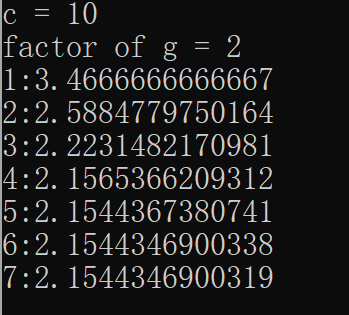
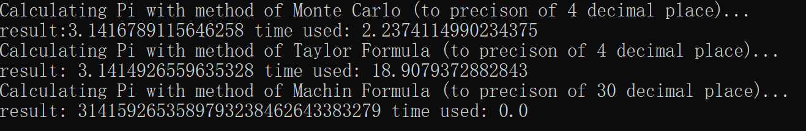
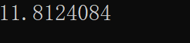

# 第二周作业

### 第一题

程序运行结果如下：



1. 所求正整数列由667个3构成。

2. 由柯西不等式可以知道，将某个数n分割成k个数，再讨论这k个数的乘积时，乘积的最大值总出现在将n等分成k个数的时候。知道了这一点以后，讨论函数 ${f(x) = k^{frac{n}{k}}}$ ，发现其最大值在 ${x = e}$ 处取得。也就是说，在上述k等分时，如果将所有的情况都假设成是连续的，那么当每一部分都等于 $e$ 时整个乘积是最大的。  
    但是对于离散的情况不可能使得每一部分等于 $e$ ,而最大值只能是近似地每一份取到 2 或者 3 时出现。使用程序进行实验，将每个数分成若干个 2 或 3 或这两个数的混合时，发现使得乘积最大的数列总满足这样的规律：

${数列包含 n 整除 3 个 3, 当 n mod 3 = 0}$
${数列包含 n 整除 3 减 1 个 3 和 2 个 2, 当 n mod 3 = 1}$
${数列包含 n 整除 3 个 3 和 1 个 2, 当 n mod 3 = 2}$

再根据以上思路进行编程实现。（代码在prob1.py文件中）

### 第二题

程序运行结果如下：



确实快

### 第三题

程序运行结果如下：



使用深度优先搜索查找图中所有可能的路径。图中 0 或 False 表示原岸， 1 或 True 表示对岸。比如：

    Sheep 0->True 表示将羊从原来的岸带到对岸

    Empty True->False 表示一个人划空船从对岸回到原岸

### 第四题

笨方法实现如下：

```python
    for i in range(n):
        if i * i < n and (i + 1) * (i + 1) >= n:
            start = i
            break

    i = start
    while i < start + 1:
        if abs(i * i - n) <= 0.0001:
            return i
        i += 0.000001
    return 0
```

运行结果如下：



### 第五题

运行结果如下：



迭代次数的增速比开根数的增速要慢得多。

### 第六题

运行结果如下：



g的大小对迭代次数的影响非常有限。

### 第七题

运行结果如下：



### 第八题

使用了三种方法计算pi，分别是：蒙特卡洛法、泰勒级数法和Machin法。三种方法的效率如下所示：



注意到泰勒级数法的效率甚至要低于蒙特卡洛法，这可能是由于程序做了太多浮点运算导致的。

### 第九题

运行结果如下：



