# 第四周作业

## 第一题

总体思路：

首先将数字分成整数部分和小数部分两个部分。

对于整数部分，直接用内置函数完成转换。

对于小数部分，循环乘以二，再取整数部分从而转换成二进制小数。

```python
def small_to_bin(small):    #small: 小数部分
    result = ""
    while (small > 0):
        small *= 2
        result += "01"[int(small)]   #截取整数部分
        small -= int(small)
    return result
```
如果是负数，那么输出时再前面加上“-”。

运行结果：

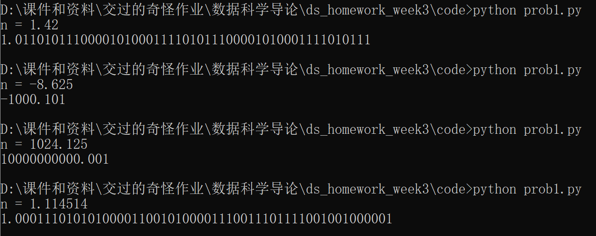

## 第二题

使用`random`库内置函数`uniform()`直接生成

运行结果：

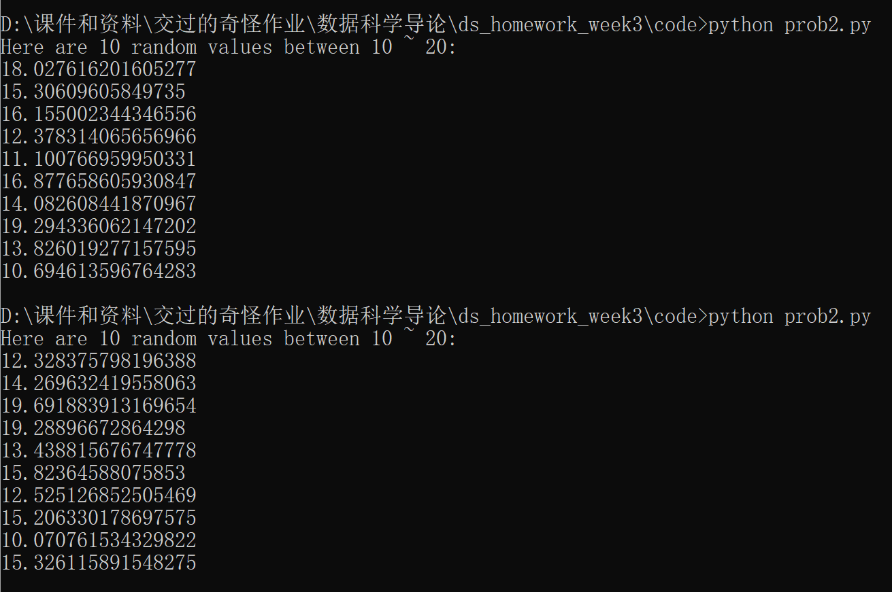

## 第三题

匹配正则表达式`(^\d[15]$)|(^\d{17}([0-9]|x)$)` (十五位数字或十八位数字，其中十八位数字的最后一位还可以是x)

运行结果：

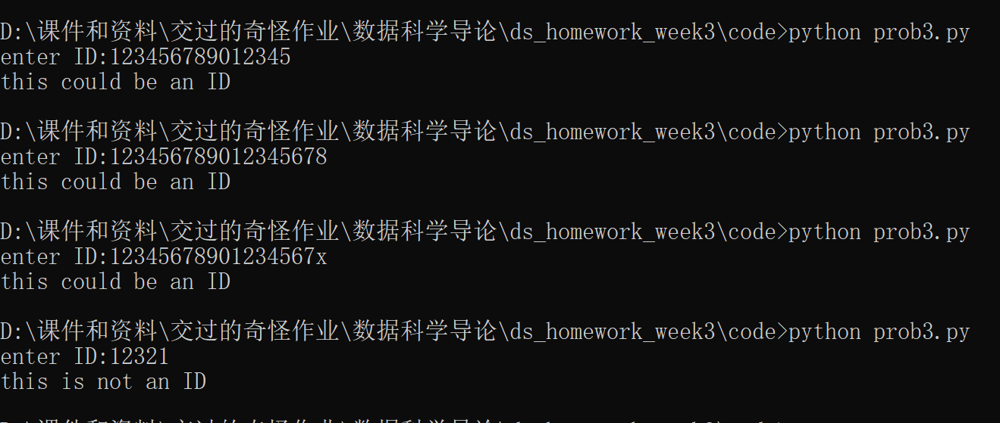

## 第四题

链表的增删查改功能

增功能实现代码：

```python
    def insert(self, data):
        new_node = Node(data)
        if self.head is None:
            self.head = new_node
        else:
            current = self.head
            while current.next:
                current = current.next
            current.next = new_node
```

增功能展示：

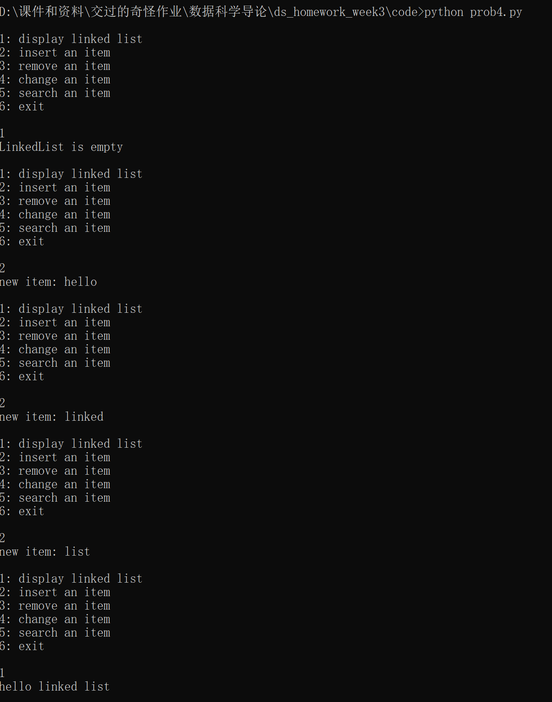

删功能实现代码：

```python
    def remove(self, data):
        if self.head is None:
            print("LinkedList is empty")
            return

        if self.head.data == data:
            self.head = self.head.next
            return

        current = self.head
        prev = None
        while current and current.data != data:
            prev = current
            current = current.next

        if current is None:
            print("Data {} not found in LinkedList".format(data))
        else:
            prev.next = current.next
            print("Data {} removed from LinkedList".format(data))
```

删功能展示：

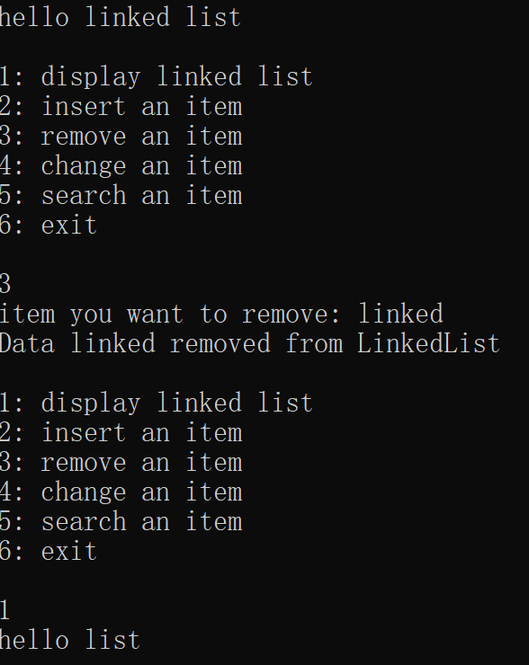

查找功能实现：


```python
    def search(self, data):
        if self.head is None:
            print("LinkedList is empty")
        else:
            current = self.head
            while current:
                if current.data == data:
                    print("Data {} found in LinkedList".format(data))
                    return
                current = current.next
            print("Data {} not found in LinkedList".format(data))
```

查找功能展示：

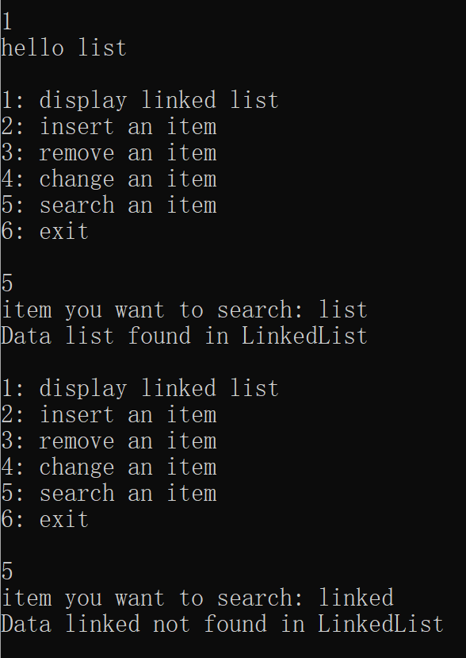

改功能实现：

```python
    def update(self, old_data, new_data):
        if self.head is None:
            print("LinkedList is empty")
        else:
            current = self.head
            while current:
                if current.data == old_data:
                    current.data = new_data
                    print("Data {} updated to {} in LinkedList".format(old_data, new_data))
                    return
                current = current.next
            print("Data {} not found in LinkedList".format(old_data))
```

改功能展示

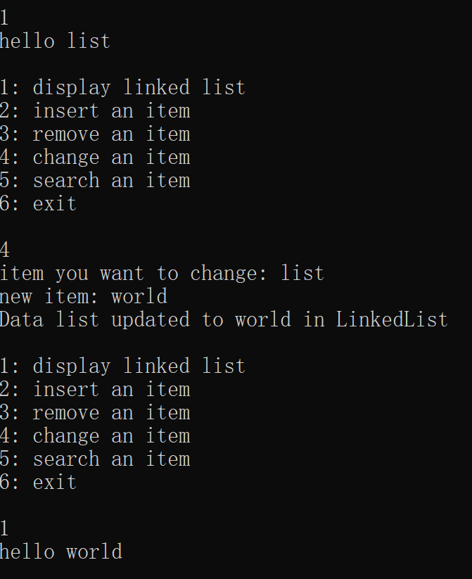

## 第五题

实现：

```python
for n in range(2, 101, 2):
    print(n, end = " ")
```

结果：

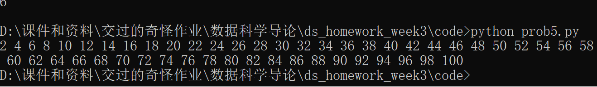

## 第六题

实现：

```python
n = float(input("input the grade (be it a number from 0 to 100):"))
if n > 100 or n < 0:
    print("invalid input")
elif n >= 90:
    print("level 优秀")
elif n >= 75:
    print("level 良好")
elif n >= 60:
    print("level 合格")
else:
    print("level 不合格")
```

结果：

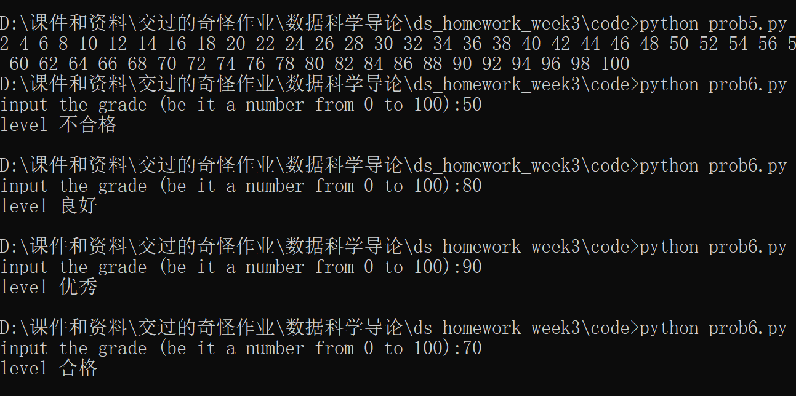

## 第七题

经典GCD算法

实现：

```python
def gcd(a, b):
    if a == b or b == 0:
        return a
    if a == 0:
        return b
    if a < b:
        b, a = a, b
    return gcd(b, a%b)
```

结果：


## 第八题

在这里使用冒泡排序和归并排序对一组随机数字进行排序，并比较它们的效率：

冒泡排序实现：

```python
def bubble_sort(arr):
  n = len(arr)
  
  for i in range(n-1):
    for j in range(n-1-i):
      if arr[j] > arr[j+1]:
        arr[j], arr[j+1] = arr[j+1], arr[j]
  
  return arr
  ```

归并排序实现：

```python
def merge_sort(arr):
  if len(arr) <= 1:
    return arr
  
  mid = len(arr) // 2
  left_arr = arr[:mid]
  right_arr = arr[mid:]
  
  left_arr = merge_sort(left_arr)
  right_arr = merge_sort(right_arr)
  
  return merge(left_arr, right_arr)

def merge(left_arr, right_arr):
  merged_arr = []
  left_idx = 0
  right_idx = 0
  lar = len(left_arr)
  rar = len(right_arr)
  while left_idx < lar and right_idx < rar:
    if left_arr[left_idx] < right_arr[right_idx]:
      merged_arr.append(left_arr[left_idx])
      left_idx += 1
    else:
      merged_arr.append(right_arr[right_idx])
      right_idx += 1
  
  while left_idx < lar:
    merged_arr.append(left_arr[left_idx])
    left_idx += 1
    
  while right_idx < rar:
    merged_arr.append(right_arr[right_idx])
    right_idx += 1
  
  return merged_arr
  ```

两种排序算法在不同的数据量之下的表现如下：

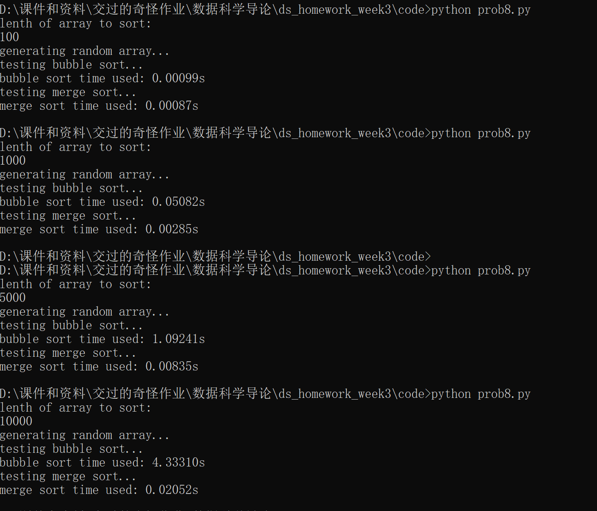

可以看到，随着数据量的增大，冒泡排序的效率急剧下降，而归并排序总是保持了相当好的效率。

## 第九题

使用动态规划的思想可以有效率地完成这个问题

```python
def prefix_product(a):
    b = []
    la = len(a)
    if la == 0:
        return b
    b.append(a[0])
    lb = 1
    for i in range(la - 1):
        b.append(b[lb - 1] * a[i + 1])
        lb += 1
    return b
```

结果展示：

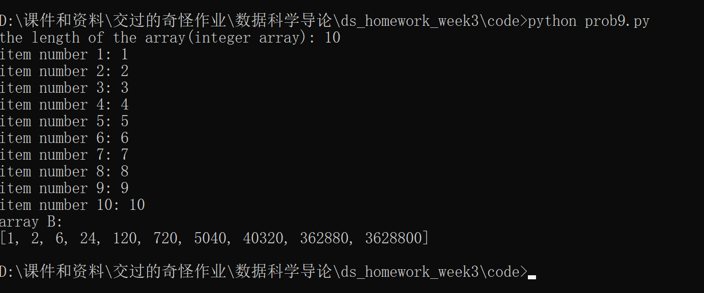

## 第四章第一题

对于整数`n`, 可以考察2到${\sqrt{n}}$之间的整数中有没有它的因子，如果没有，则说明`n`是一个质数。

```python
def isPrime(n):
    if n <= 1:
        return False
    for i in range(2, int (n ** 0.5) + 1):
        if n % i == 0:
            return False
    return True
```

结果展示：

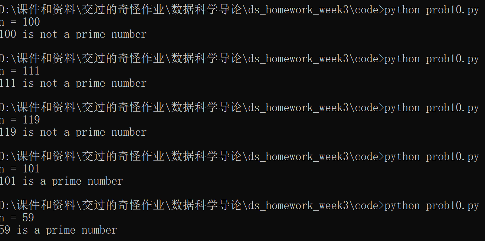

## 第四章第二题

可以使用`time`库函数中的`time()`函数分别得到程序执行之前和之后的时间，作差得到程序运行的时间。

比如在[第三章第八题](./code/prob8.py)中：

```python
start_time = time()
bubble_sort(a1)
end_time = time()
print("bubble sort time used: {:.5f}s".format(end_time - start_time))
```

## 第四章第三题

直接插入排序实现如下:

```python
def direct_sort(a):
    la = len(a)
    if (la <= 1):
        return
    for i in range(1, la):
        pos = i - 1
        now = a[i]
        while pos >= 0 and a[pos] > now:
            a[pos+1] = a[pos]
            pos -= 1
        a[pos + 1] = now
```

流程图如下：

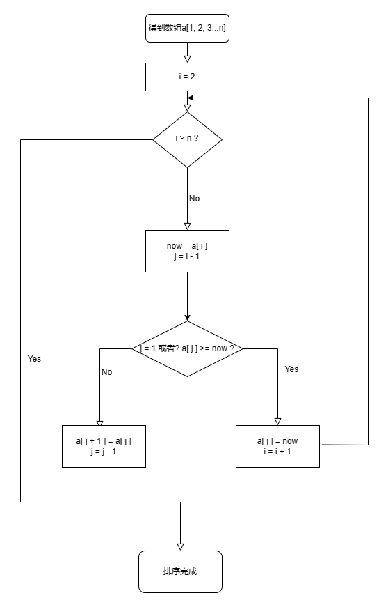


结果展示：

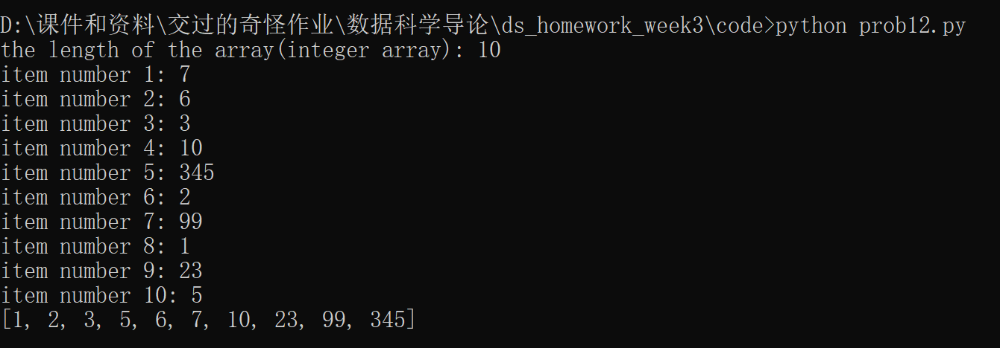

## 第四章第四题

由于此算法中有两层有关于数组长度`n`的循环，因此总的时间复杂度是${O(n^2)}$。

由于没有使用额外的空间，只需要将数组保存在内存中，所以总的空间复杂度是${O(n)}$

