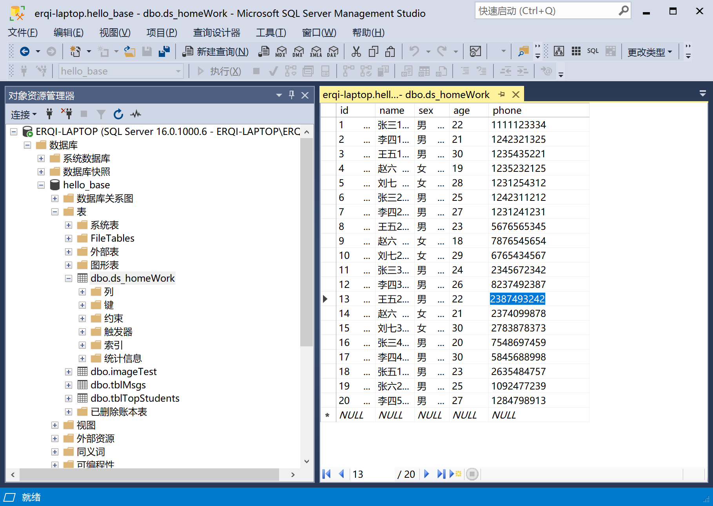
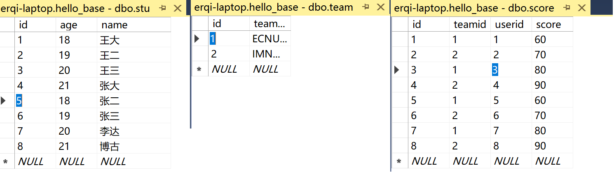

# 第四周实验报告

## 6.1

[代码](./code&files/6.1/worm.py)

爬取效果：

## 6.2

Scrapy是一个强大的Python爬虫框架，它有以下优点和缺点：

优点：

高效性：Scrapy使用异步处理和并发机制，可以高效地处理大量的请求和响应。它使用Twisted作为底层网络引擎，具有出色的性能。
可扩展性：Scrapy具有模块化的结构，可以通过编写扩展和中间件来自定义和调整其功能。您可以根据自己的需求轻松地添加新的组件和功能。
配置灵活：Scrapy提供了丰富的配置选项，您可以根据需要进行调整。您可以设置各种下载器中间件、管道和过滤器，来控制爬取过程中的请求、响应和数据处理。
内置的数据处理机制：Scrapy提供了内置的数据处理机制，如XPath和CSS选择器，使您能够方便地从网页中提取所需的数据，并进行清洗和转换。
良好的文档和社区支持：Scrapy拥有广泛的文档和活跃的开发者社区，您可以在官方文档、邮件列表和社交媒体上找到大量的教程、示例和帮助。
缺点：

学习曲线较陡峭：由于Scrapy是一个功能强大的框架，对于新手来说，学习和理解其概念和工作原理可能需要一些时间。
依赖较多：Scrapy依赖于一些第三方库和工具，如Twisted和lxml。这些依赖可能会增加项目的复杂性和安装的难度。
不适合小规模任务：如果您只需要简单地爬取几个页面或处理少量的数据, Scrapy可能会显得过于庞大和复杂。对于小规模的任务，其他简单的库也可以胜任。
反爬虫机制：一些网站会采取反爬虫策略，如设置访问速率限制、页面解析难度提高等，这会增加爬取的难度，需要采取相应的策略和技术来应对。

## 6.3

[实验所使用爬虫项目已打包](./code&files/myfirstPJ.rar)

创建效果：

## 6.4

爬取效果

简单处理得到名称后

## 6.5

在6.4基础上自动爬取了二级书籍页面

爬取效果

相关文件在项目压缩包`./sub_htmls`目录中。

## 7.1 7.2 7.3

使用了sql Server

创建表格效果如下

## 7.4

查询效果如下：

## 7.5

效果如下：

## 7.6

## 7.7

包含张的都删完了，这里用姓李的代替

## 7.8

创建表格数据如下：

## 7.9

## 7.10

