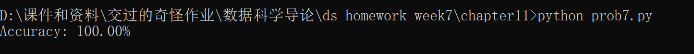
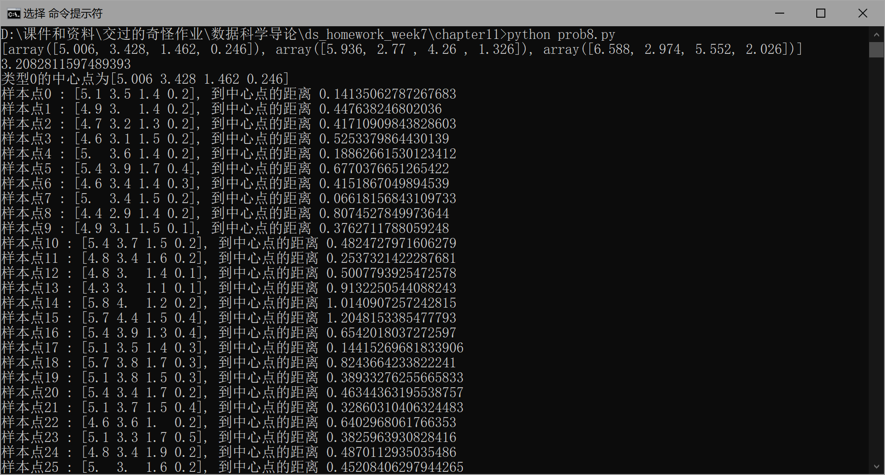
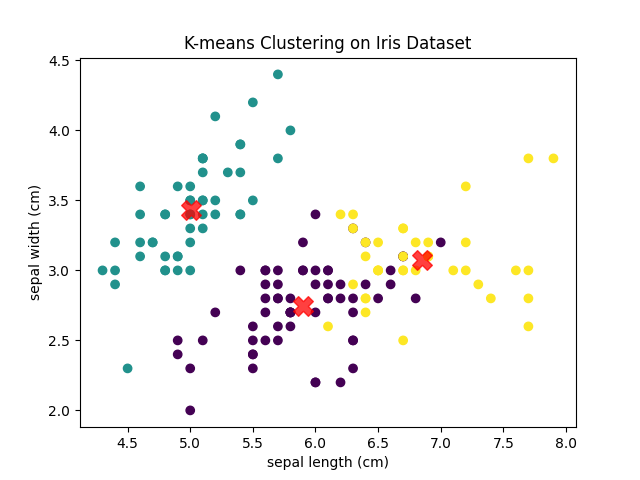
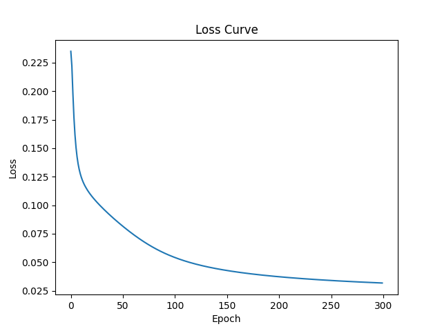
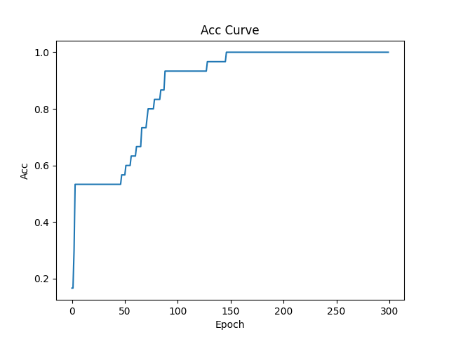
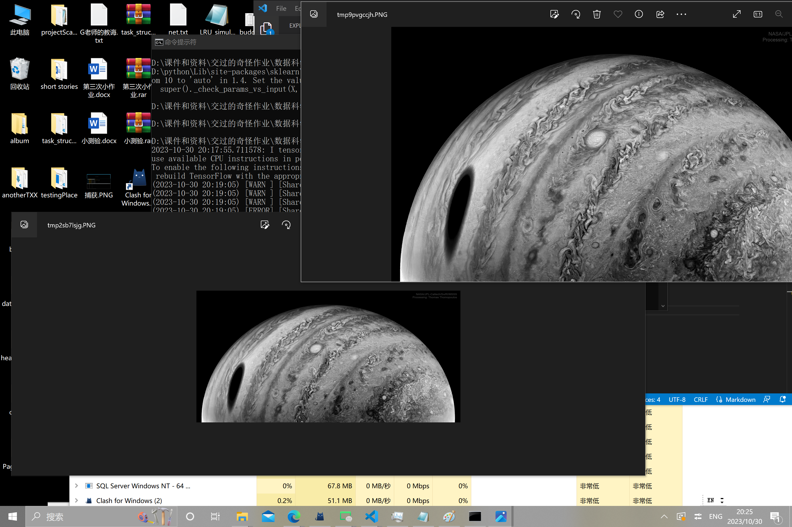
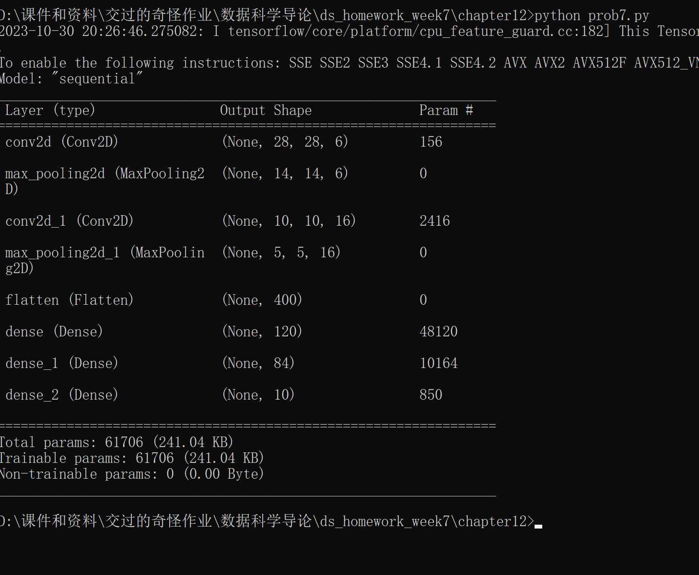
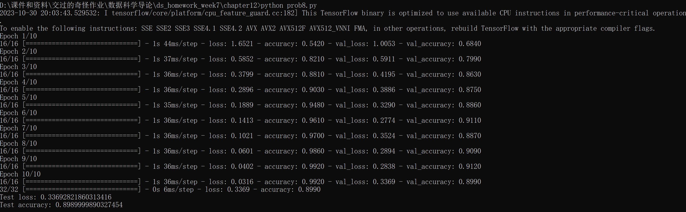

# 第7周作业

## chapter11: 5

Logistic回归模型可以用于处理二分类问题，其模型形式如下：

$$
h_{\theta}(x) = \frac{1}{1+e^{-\theta^Tx}}
$$

其中，$h_{\theta}(x)$表示预测值，$\theta$表示模型参数向量，$x$表示输入特征向量。

为了求解Logistic回归模型，我们需要定义一个损失函数，并通过梯度下降法最小化该损失函数。一种常用的损失函数是对数似然损失函数，其定义如下：

$$
J(\theta) = -\sum_{i=1}^m (y^{(i)}\log(h_{\theta}(x^{(i)})) + (1-y^{(i)})\log(1-h_{\theta}(x^{(i)})))
$$

其中，$m$表示样本数量，$y^{(i)}$表示第$i$个样本的真实标签，$x^{(i)}$表示第$i$个样本的特征向量。

接下来，我们通过梯度下降法最小化损失函数$J(\theta)$。梯度下降法的迭代过程如下：

1. 初始化模型参数向量$\theta$为任意值。

2. 计算损失函数的梯度：$\frac{\partial J(\theta)}{\partial \theta_j} = \sum_{i=1}^m (h_{\theta}(x^{(i)}) - y^{(i)}) x_j^{(i)}$

3. 更新模型参数：$\theta_j := \theta_j - \alpha \frac{\partial J(\theta)}{\partial \theta_j}$ (其中，$\alpha$为学习率，控制参数更新的步长）

4. 重复步骤2和步骤3直到满足停止条件（如达到最大迭代次数或损失函数的下降幅度小于某个阈值）。

在梯度下降法的迭代过程中，每次更新模型参数时需要对所有的样本进行求和，这被称为批量梯度下降法（Batch Gradient Descent）。还可以使用随机梯度下降法（Stochastic Gradient Descent）或小批量梯度下降法（Mini-batch Gradient Descent）来优化模型更新的效率。

## chapter11: 6

[代码](./chapter11/prob6.py)

## chapter11: 7

[代码](./chapter11/prob7.py)

结果

## chapter11: 8

结果

[完整结果](./result_image/chapter11/result_8.txt)

## chapter11: 9

结果

## chapter12: 4

结果

## chapter12: 5

原图

灰度图和放缩图

## chapter12: 7

效果

## chapter12: 8

效果
