# 基于LSTM模型的城市用电量预测

## 导言

用电量预测对于能源行业和能源使用者而言是非常重要的工具，可用于提高能源管理和运营效率，实现可持续发展，降低供能风险，促进电力系统的可靠性和可持续性。能源规划和管理， 负荷均衡和优化， 资源调度和运维， 能源市场交易， 节能和可持续发展。

城市或者某一地区的用电量通常展现出规律的周期性：比如一天当中某些时段的用电量要显著高于另一些时段的用电量、一周当中周末的用电量跟工作日的用电量展现出一定的差异、一年当中某些季节的用电量要显著高于其他季节的用电量等，这是由于城市居民的生活习惯和工厂的生产情况所导致的。这使得用电量成为一个可以被适当手段有效预测的工业指标。

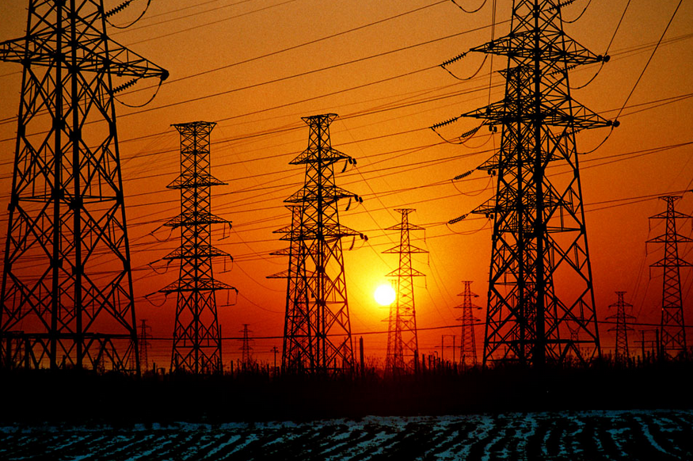

本项目将利用循环神经网络(RNN)的变种长短期记忆模型(LSTM), 使用回归模型和时间序列分析的方法来预测城市的实际用电量。
<br> <br>


## 实验数据初步分析

本次实验的数据统计了摩洛哥北部城市得土安（Tétouan）的三个区域（ Quads, Smir 和 Boussafou）从2017年1月1日0点0分到2017年12月31日9点50分的电力使用情况（每10分钟一记）。

得土安是一座位于摩洛哥北部的城市，面积约 10375 平方公里，根据 2014 年最后一次人口普查，人口约为 550,374 人，并且正在迅速增长，每年约 1.96%。 由于地处地中海沿岸，冬季气候温和多雨，夏季炎热干燥。

实验数据来源：https://archive.ics.uci.edu/ml/datasets/Power+consumption+of+Tetouan+city


除了时间和用电量之外，数据还包括了温度、湿度、风速等其他信息。

(前五条数据展示)

|	Datetime	|Temperature	|Humidity	|WindSpeed	|GeneralDiffuseFlows	|DiffuseFlows	|PowerConsumption_Zone1	|PowerConsumption_Zone2	|PowerConsumption_Zone3|  
|---|---|---|---|---|---|---|---|---|
|0	|1/1/2017 0:00	|6.559	|73.8	|0.083	|0.051	|0.119	|34055.69620	|16128.87538	|20240.96386|
|1	|1/1/2017 0:10	|6.414	|74.5	|0.083	|0.070	0.085	|29814.68354	|19375.07599	|20131.08434|
|2	|1/1/2017 0:20	|6.313	|74.5	|0.080	|0.062	0.100	|29128.10127	|19006.68693	|19668.43373|
|3	|1/1/2017 0:30	|6.121	|75.0	|0.083	|0.091	0.096	|28228.86076	|18361.09422	|18899.27711|
|4	|1/1/2017 0:40	|5.921	|75.7	|0.081	|0.048	0.085	|27335.69620	|17872.34043	|18442.40964|

绘图查看各个统计数据之间的相关性：

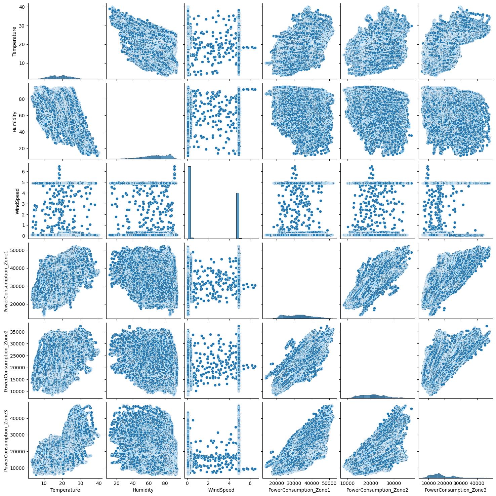

从图中可以看到，温度和三个区域的用电量之间基本呈现正相关的趋势，这可能是由于当地冬季温暖、夏季炎热的气候所导致的：当地居民在气温较低时并没有取暖的需求，但是在气温过高时却有使用空调等电器的需求。

至于湿度和用电量所呈现的负相关性，这可能仅仅是由于当地的地中海气候导致的温度和湿度呈现的负相关性导致的，而不是直接影响当地居民的用电需求。当然，仅靠相关性不足以推断背后的原因，探索其中的原因还需要更多的相关研究工作。

计算各个变量之间的相关性：

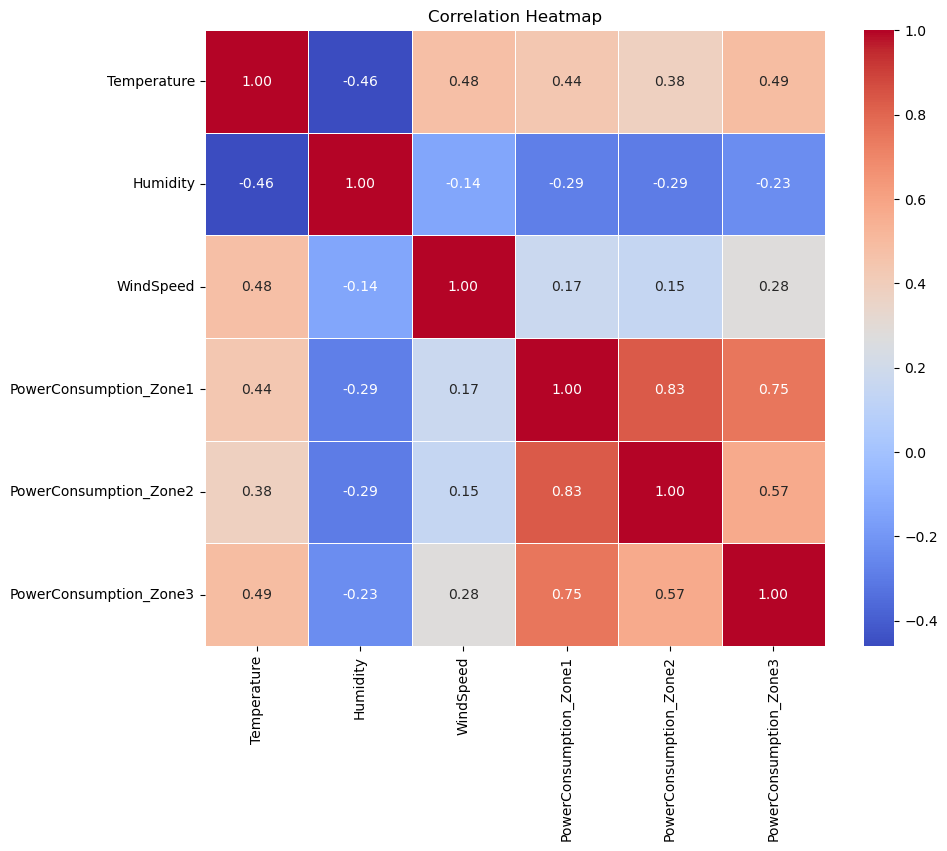

从数值方面进一步可以印证图中主观判断的相关性。

下面分析用电量在时间轴上的变化：

首先可视化所有数据在整个时间轴上的分布（三张图分别是Quads, Smir和 Boussafou三个区域的整个用电量）：

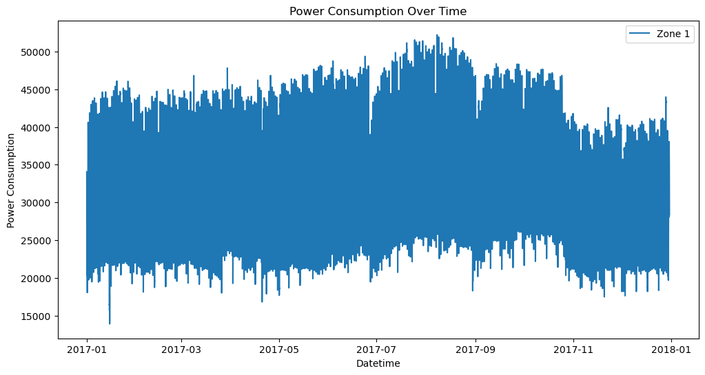
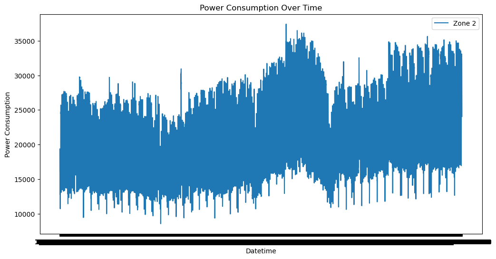
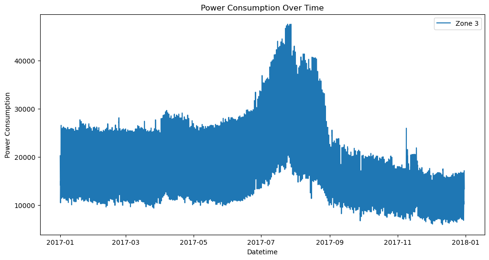

可以看到 Boussafou 的用电量在八月份左右达到了明显的峰值，这可能是由于空调等降温设备耗电导致的。而Quads, Smir个的用电量虽然在八月份也达到了一个峰值，但是效果远不如 Boussafou 的明显。这说明季节对 Boussafou 用电量的影响要高于对其他两地的影响。

通过分别计算三个区域的日均用电量，再绘制到一张图上，可以更好地看到每个区域的用电量的变化情况和三个区域的用电量之间的大小关系。

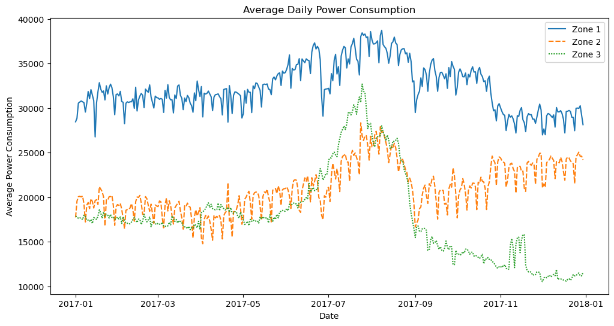

可以看到在三个区域当中 Quads 的用电量一直最高，而 Smir 和 Boussafou 的用电量相对而言较低。值得注意的是，在2017年9月份之前 Smir 和 Boussafou 的用电量基本相同，但是从2017年9月1日直到2018年元旦 Boussafou 的用电量持续走低，而 Smir 的用电量则有上升的趋势。这种趋势很可能是由于从2017年9月1日开始当地的供电状况发生了一些变化导致的（以前由Boussafou供电的一些区域改为由Smir供电，做出这种假设的原因是两个区域的供电量总和与上半年的供电量总和基本持平），因为到2018年元旦时三个区域的供电量关系相比2017年元旦来说已经变得极为不同。

总的来说，三个区域的供电量或多或少都呈现出冬天供电量小，夏天供电量大的趋势。


## 特征工程

为了从已有信息中提炼出更多的特征信息使得预测的效果更加准确，还应当从时间信息中提炼出更多的相关特征：比如是否是周末、是什么季节、处于一点当中的什么时段等等。这可以帮助算法更有效地理解数据和进行更准确的预测。

```python
    # Additional features
    df['is_weekend'] = df['dayofweek'].isin([5, 6]).astype(int)
    df['is_month_start'] = (df['dayofmonth'] == 1).astype(int)
    df['is_month_end'] = (df['dayofmonth'] == df.index.days_in_month).astype(int)
    df['is_quarter_start'] = (df['dayofmonth'] == 1) & (df['month'] % 3 == 1).astype(int)
    df['is_quarter_end'] = (df['dayofmonth'] == df.groupby(['year', 'quarter'])['dayofmonth'].transform('max'))
    
    # Additional features
    df['is_working_day'] = df['dayofweek'].isin([0, 1, 2, 3, 4]).astype(int)
    df['is_business_hours'] = df['hour'].between(9, 17).astype(int)
    df['is_peak_hour'] = df['hour'].isin([8, 12, 18]).astype(int)
    
    # Minute-level features
    df['minute_of_day'] = df['hour'] * 60 + df['minute']
    df['minute_of_week'] = (df['dayofweek'] * 24 * 60) + df['minute_of_day']
```

## 模型介绍

### RNN

RNN（循环神经网路）是一种神经网路模型，主要用于处理序列数据，例如文本、音频、时间序列等。与传统的前馈神经网络不同，RNN在每个时间步骤将输入和隐藏状态传递到下一个时间步骤，以建立上下文信息和记忆能力。


RNN具有内部循环结构，使得网络可以保持一种记忆，通过隐藏状态传递信息。这种记忆机制使得RNN能够更好地处理序列数据，能够考虑之前的信息以及当前的输入来进行预测或生成输出。


### LSTM

LSTM（长短期记忆网络）是RNN（循环神经网络）的一种特殊类型。RNN是一种通用的序列模型，而LSTM是为了解决RNN遇到的梯度消失和梯度爆炸问题而提出的一种改进的RNN架构。

RNN的主要问题是当序列长度较长时，梯度会逐渐变为零或变为无穷大，导致难以训练。LSTM通过引入一个记忆单元（cell）来解决这个问题。记忆单元可以存储和传递信息，同时通过门控机制来控制信息的流动。LSTM中的三个主要门控（输入门、遗忘门和输出门）可以控制通过和保留哪些信息，并且通过加权和元素级操作来更新记忆单元的内容。

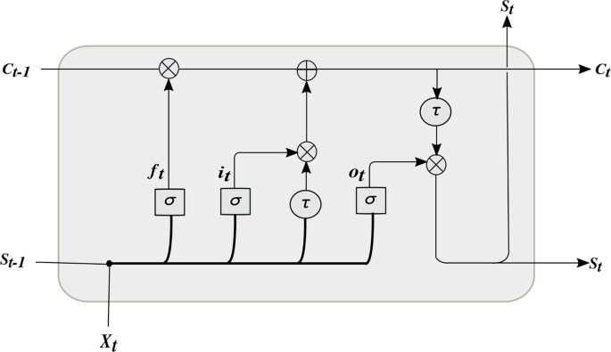

因此，LSTM相对于普通RNN具有更好的记忆能力，能够更好地捕捉长期依赖关系。LSTM广泛应用于需要处理长期依赖的任务，例如文本生成、情感分析、语音识别等。同时，LSTM的变体如GRU（门控循环单元）也被提出来以简化LSTM的结构，但仍具有类似的门控机制。

## 模型搭建

### 回归方法

模型构建：

```python
model_lstm = Sequential()
model_lstm.add(LSTM(50, activation='relu', input_shape=(X_train_series.shape[1], X_train_series.shape[2])))
model_lstm.add(Dense(3))
model_lstm.compile(loss='mse', optimizer=tf.keras.optimizers.legacy.Adam(lr))
model_lstm.summary()
```

模型输入为经过特征工程和归一化后的源数据，去掉三个被预测的电量数据后每个一共有26个维度。

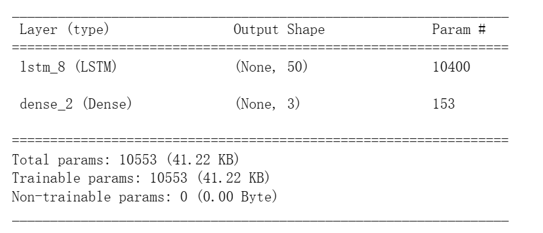

模型输出为一个三维向量，分别表示三个区域用电量的预测值。

### 时间序列

模型构建：

```python
model_lstm_ts = Sequential()
model_lstm_ts.add(LSTM(50, activation='relu', input_shape=(X_train_LSTM.shape[1], X_train_LSTM.shape[2])))
model_lstm_ts.add(Dense(3))
model_lstm_ts.compile(loss='mse', optimizer=tf.keras.optimizers.legacy.Adam(0.000003))
model_lstm_ts.summary()
```

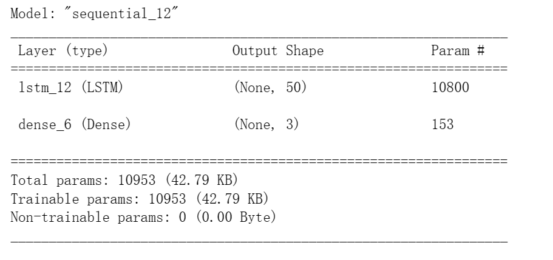

模型输入为一个 ${114 \times 3}$ 的矩阵，114行表示之前114个时间片中供电量，每列的三个数据分别表示三个区域的供电量。

## 预测效果

### 回归模型

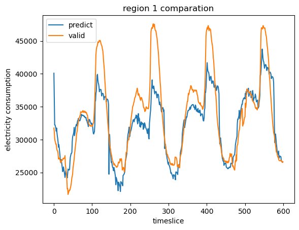
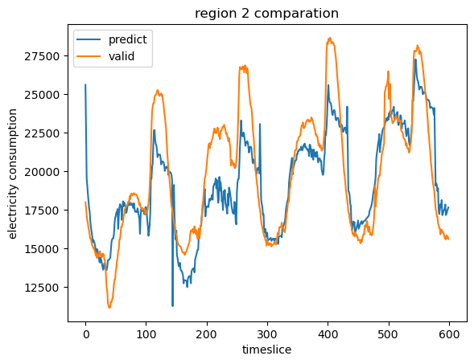
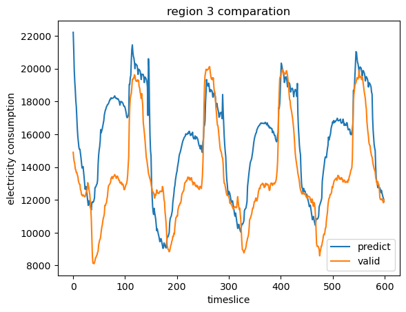

通过对比模型预测的用电量和实际的用电量，可以看到回归模型在预测下一个时间点是上升还是下降方面有着很好的灵敏度，但是对最终的峰值和谷值的预测往往达不到好的效果：比如在第一张图片的地100号时间片处模型正确地预测了用电量将有大幅度的上涨，但是预测的上涨幅度却只有实际上涨幅度的一半。

相同的情况也同样出现在对二号区域的预测当中：虽然对有些谷值的预测效果与实际效果差不多，但是对峰值的预测普遍来说都低于实际的情况。


### 时间序列

对测试集中前五百个时间片的预测和实际值的比较：

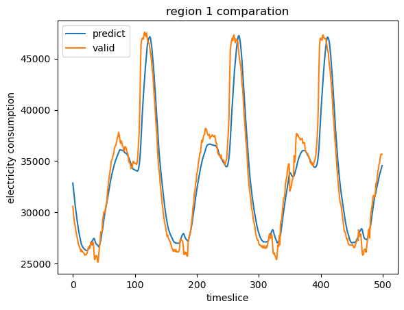
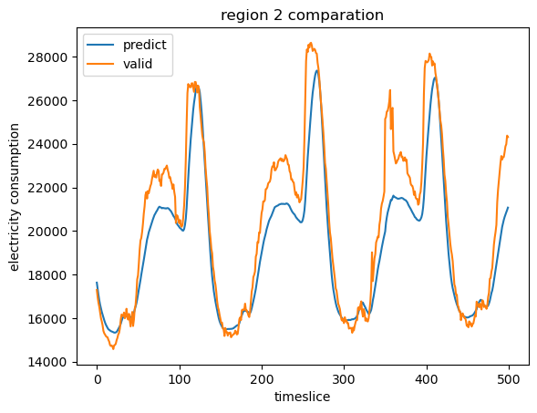
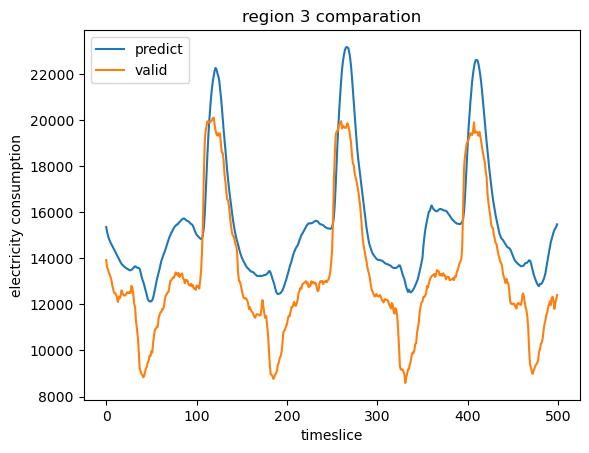

可以看到时间序列分析模型拟合的最好的区域是region1（Quads），虽然在峰度的上升沿中预测有些滞后现象，但是在下降沿中预测效果较好。

时间序列分析的曲线相对回归分析预测值和实际值的曲线而言较为光滑，而且对于第一、第二个区域用电量的峰值的预测较为准确。但是在对第三个区域的用电量进行预测时可以看到预测值相较于实际值都偏高。

时间序列分析可以较为准确地分析到峰值和谷值，但是问题在于总体来看时间序列分析的预测结果有一定的滞后现象。尤其是开始上升时偏向于等到实际值开始大幅上升时再预测用电量将开始大幅上升。这一点体现在图一和图二中蓝线基本贴合在黄线右侧。


## 总结与展望

比较两种方法预测结果的偏差值：

回归分析：

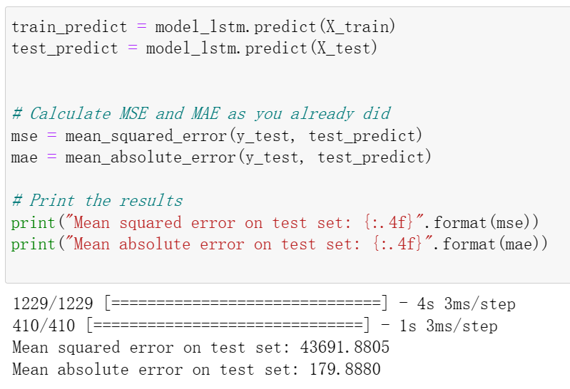

时间序列：

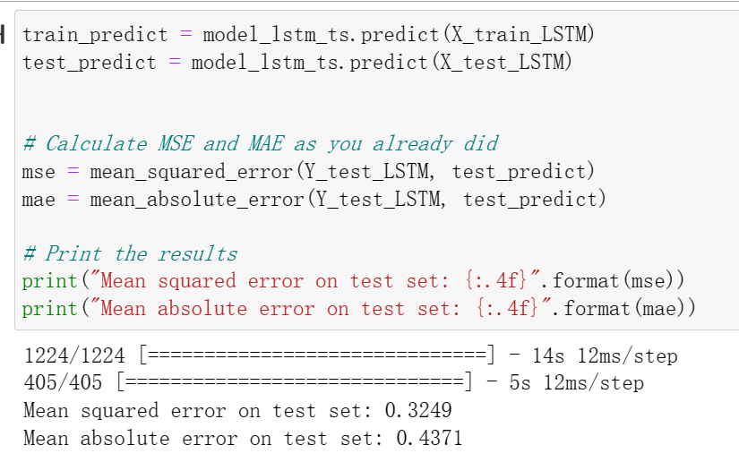

可以看到，在总的偏差方面，时间序列分析的结果要好于回归分析的结果，但是这并不意味着回归分析没有价值。

在预测效果中，回归模型相对而言对数据变动的预测更加灵敏，但是对于峰值的预测的拟合效果不是很好。而时间序列分析的方法虽然可以较为精准的预测极值，但是总体而言有一定的滞后性质。

在对预测的下一步优化中，可以考虑在用电量开始变动的时间段内使用回归方法预测，而在极值处使用时间序列的方法来预测。

初此之外，两种方法对 Boussafou （区域3）的用电量预测都比较偏高，而对 Smir （区域2）的用电量预测都比较偏高。这可能是由于前面提到的2017年9月1日开始两地的供电模式发生的显著变化导致的。要解决这个问题，可以考虑在供电模式相对稳定的一段时间内做及时的采样和预测。

